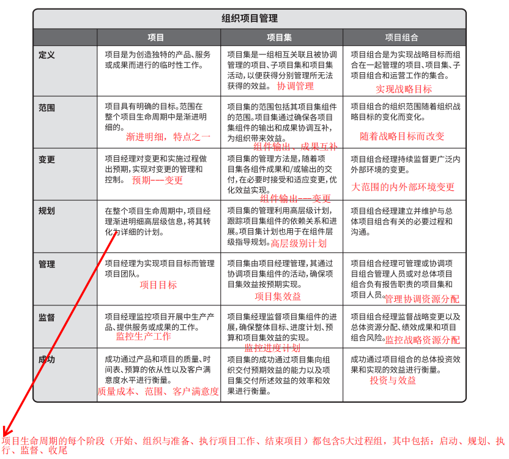
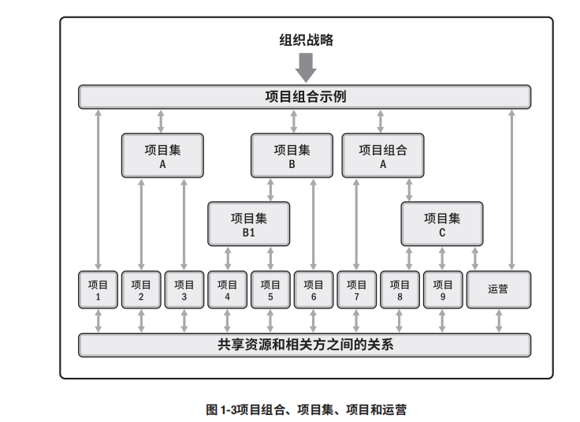
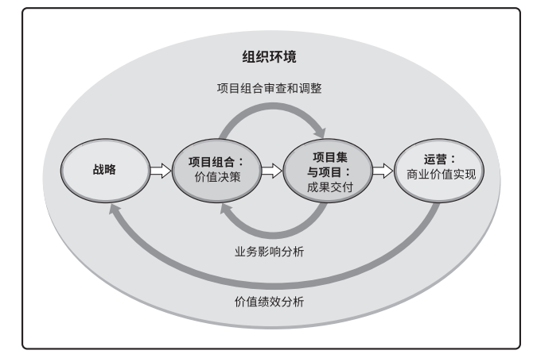

# IT项目管理 Homework1
## 内容
### 讨论`projects`、`programs`、`portfolio`之间的关系和对企业成功的贡献，以及与`operations`和`OPM`的关系。

## 要求
- 必须描述`projects`、`programs`、 `portfolio` 、 `operations` 和 `OPM` 的概念；
- 必须用`图`或`表格`表达它们之间的`关系`与`区别`，使得读者更容易理解；
- 必须列举合适案例用以区别这些概念

### 1、基本定义
**`projects`：** `项目`，是为创造独特的产品、服务或成果而进行的`临时性工作`。 

**`programs`：** `项目集`，是一组`相关互联`且`被协调管理`的项目、子项目集和项目集活动，以便获得分别管理所无法获得的效益。 

**`portfolio`：** `项目组合`，是指为`实现战略目标`而组合在一起管理的项目、项目集、子项目组合和运营工作的集合。 

**`operations`：** `运营管理`，它关注产品的`持续生产`和（或）服务的`持续运作`。它使用`最优资源`满足客户要求，来保证业务运作的`持续高效`。它重点管理那些把各种输入（如材料、零件、能源和劳力）转变为输出（如产品、商品和（或）服务）的过程。  

**`OPM`：** 全称为Organization Project Management，即`组织项目管理`，指为`实现战略目标`而`整合`项目组合、项目集和项目管理与组织驱动因素的框架。它旨在确保组织`开展正确的项目`并合适地`分配关键资源`。

### 2、`projects（项目）`、`programs（项目集）`和`portfolio（项目组合）`的比较和对企业成功的贡献  
- 比较如下图

       
  
- 对企业的贡献
   - `项目管理`：项目是组织创造价值和效益的主要方式。在当今商业环境下，组织领导者需要应对预算紧缩、时间缩短、资源稀缺以及技术快速变化的情况。商业环境动荡不定，变化越来越快。为了在全球经济中保持竞争力，公司日益广泛利用项目管理，来持续创造商业价值。有效和高效的项目管理应被视为组织的战略能力，它使组织能够：

      - 将项目成果与业务目标联系起来
      - 更有效地展开市场竞争
      - 支持组织发展
      - 通过适当调整项目管理计划，以应对商业环境改变给项目带来的影响

   - `项目集管理`：项目集管理注重作为组成部分的项目与项目集之间的依赖关系，以确定管理这些项目的最佳方法。好的项目集管理能对企业有如下帮助：  

      - 在同一个治理框架内管理变更请求
      - 更有效的规划项目的预算
      - 确保有关系的多个项目能够实现效益
      - 通过对有依赖关系的项目进行统一管理，从而以最佳方式实施项目    

   - `项目组合管理`：项目组合管理是指为了实现战略目标而对一个或多个项目组合进行的集中管理。项目组合中的项目集或项目不一定彼此依赖或直接相关。有效的项目组合管理能对企业有一下贡献：

      - 指导组织的`投资决策`
      - 选择项目集与项目的`最佳组合方式`，以达成战略目标
      - 提供`决策透明度`
      - 确定团队和实物资源分配的`优先顺序`
      - 提高实现预期`投资回报`的可能性
      - 实现对所有组成部分的`综合风险预测`的集中式管理  

### 3、`projects（项目）`、`programs（项目集）`、`portfolio（项目组合）`和`operations（运营管理）`之间的关系
  
  

### 4、`projects（项目）`、`programs（项目集）`、`portfolio（项目组合）`、`operations（运营管理）`以及`OPM（组织项目管理）`之间的关系  

   

### 5、案例（参考PMBOK6中文版）
&emsp;&emsp;以"投资回报最大化"为`战略目标`（体现项目组合的功能）的某基础设施公司，可以把油气、供电、供水、道路、铁路和机场等`项目`归并成一个`项目组合`。在这些归并的项目中，组织又可以把相互关联的项目作为`子项目组合`来管理。所有供电项目归类成`供电项目组合`，同理，所有供水项目归类成`供水项目组合`。然而，如果组织的项目是设计和建造发电站并运营发电站，这些相互关联的项目可以归类成一个`项目集`。这样的话，`供电项目集`和类似的`供水项目集`就是该基础设施公司项目组合中的基本组成部分。
