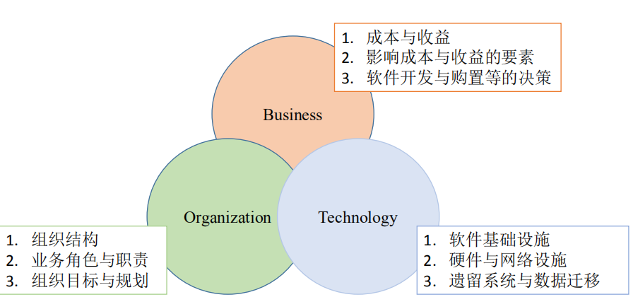

## 作业要求：使用业务、组织、技术三维模型系统管理方法分析某校园项目（可自定义）的可行性
  

### 校园项目：`食堂点餐程序`

### 业务
- `成本与收益`：该项目的成本主要来自于点餐程序的设计、服务器的搭建、数据的管理以及程序的运维，当然除了前面提到技术成本，还有宣传成本，员工工资等；收益方面，可以通过与食堂里的店家合作，通过`学生下单抽成`或者每`月定"租金"的方式获取利益，因为食堂店面有限，如果仅在一个校园内服务的话，不适合通过出售程序的方式获取利益。

- `影响成本与收益的要素`：成本方面，主要影响因素为服务器和网络设备（交换机、路由器等）的多少以及后期运维的力度。利益的影响因素首先是`知名度`，直接决定了该项目前期体验用户的多少，所以要做好前期的宣传；其次是`竞争力`，这一要素决定了该项目能够走多远，想要打破传统的点餐方式，要做到更具竞争力，主要体现在“是否更加方便”、“是否更加快捷”、“是否更加实惠”等方面，如果与传统点餐方式相比没有任何突破，那这个项目就没有存在的必要；最后是`吸引力`，这一要素是保证收益的关键，要想具有更大吸引力，不光要让服务方便、快捷、经济，还要给用户一些福利，比如“满减优惠”等，这是许多外卖行业都在做的。  

- `软件开发与购置等的决策`：软件开发与购置的决策主要为`“在保证质量的情况下尽量控制成本最低”`。

### 组织
- `组织结构`：该项目组织需要包括`宣传部`、`技术部`、`财政部`、`外联部`、`行政部`等。

- `业务角色和职责`：宣传部门人员的职责在于对项目进行宣传，让更多的学生以及食堂店面知道该项目；技术部门人员负责点餐程序的设计，数据的分析与管理以及运维工作；财政部负责管理财政收入；外联部的人员负责与食堂店面合作的问题；行政部门负责管理该项目的行政问题，如专利申请、网络许可证的办理等。
  
- `组织目标和规划`：组织的内部目标当然是获取更多的盈利；组织的外部目标主要是让食堂点餐业务更加的方便、快捷、实惠。至于规划问题，这些都比较飘渺了，一般来讲，就是盈利、软件系统的更新等等。

### 技术
- `软件基础设施`：`点餐程序`、`数据库`等。
- `硬件与网络设施`：`服务器`和若干`交换机`、`路由器`等。
- `遗留系统与数据迁移`：直接对`服务器`和`数据库`进行迁移即可。  

### 总结
通过`三维模型系统管理方法`分析食堂点餐程序项目表明该项目是可行的。