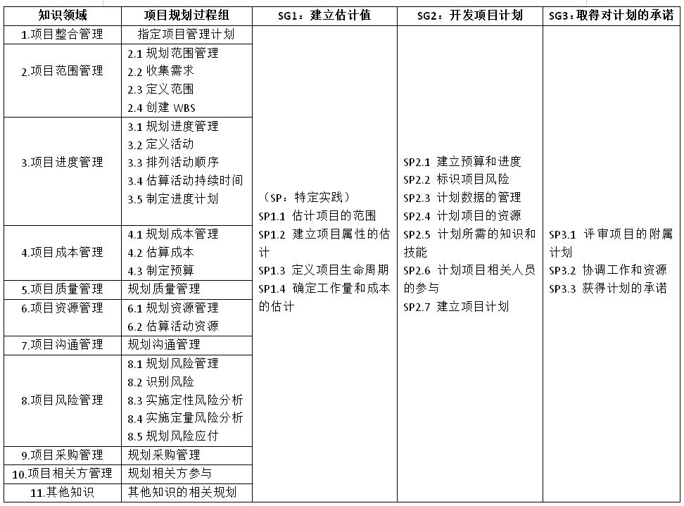

# IT项目管理 Homework3
## 作业要求
  

## 题目1
### 1. 知识域*过程矩阵
- **十大知识领域如下**：  

     
   
  
- **十大知识领域及其项目管理过程图如下**：

     

- **绘制矩阵如下**：

     

### 2. 项目管理规划过程组与行业过程PP的联系与区别小结  
- **联系**
   - 行业过程PP中的`SG1`对应着十大知识领域中的`项目范围管理过程`和`项目成本管理过程`；`SG2`对应着`项目成本管理`、`项目时间管理`、`项目资源管理`、`项目相关方管理`；SG3对应`项目相关方管理`的细节。

- **区别**
   - 对比`SG1`和`项目管理规划过程`可以发现，前者`工作量和成本的估计`是在`WBS建立后`就可以进行，而后者需要先进行`项目进度管理`，即`活动的定义和排序`等。  

   - 对比`SG2`和`项目管理规划过程`可以发现，前者包含了预算和进度计划（SP2.1，对应知识领域3、4）、项目风险计划（SP2.2，对应知识领域8）、数据管理计划、项目资源计划（对应知识领域6）等，与后者相比，缺少了`质量管理`。  

   - 对比`SG3`和`项目管理规划过程`可以发现，前者对于`相关方`（干系人）的工作解析得更加详细，而后者比较笼统地表示为`规划相关方参与`。
## 题目2  

软件项目创新竞赛`项目准备过程（组）`
- 决定项目范围、时间和成本约束
- 识别项目发起人
- 识别利益相关者，制定创新竞赛章程
- 开发项目业务场景（`business cases`）
- 开会讨论软件项目创新竞赛管理过程
- 确定项目是否分为多个子项目，并对工作进行分配