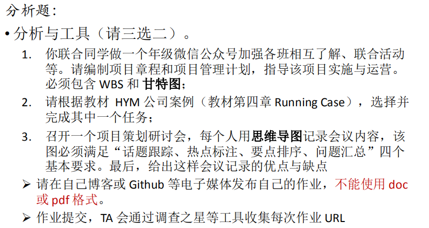
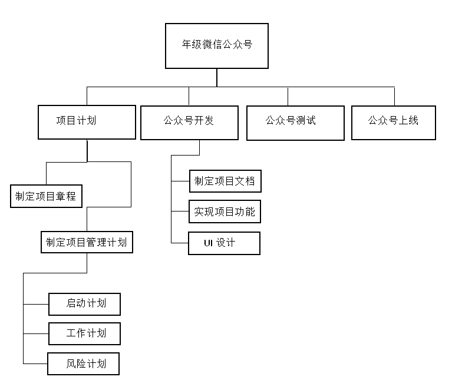
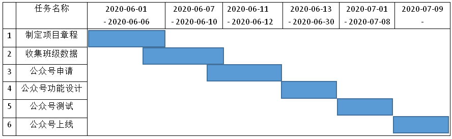
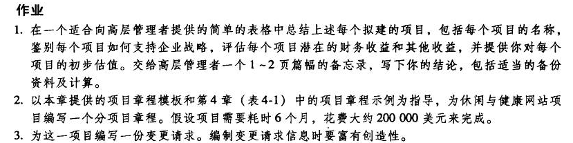

# IT项目管理 Homework4
## 作业要求
  

## 题目1
### 项目章程  
- `项目名称`：年级微信公众号  

- `项目目的`：让各班相互了解，加强年级凝聚力，方便联合活动等  

- `成功标准`：
   - 各班能通过访问公众号了解年级其他班级的情况（班级学生、班干部等）  

   - 各班管理员以及年级老师能够在公众号上发布活动，并号召其他班参与
- `高层级需求`：界面简介美观，内容丰富，功能齐全，检索方便。

- `整体项目风险`：
   - `需求风险`：每个班的信息可能会不断变化，在这个过程中如果班级参与不够，即信息的更新不及时就会导致需求风险。  

   - `计划风险`：因为项目的计划可能由年级领导以及开发团队给出，所以可能会不一致。  

   - `组织和管理风险`：管理层审查以及决策的周期比预期的时间长。  

   - `设计和实现风险`：因为要根据本年级的情况进行公众号设计，所以可能由于缺乏经验使设计质量低下，从而导致重复设计。  

- `总体里程碑进度计划`：6月1日开始项目，6月6日之前制定好项目章程；6月10日之前收集好各班的信息；6月12日之前完成公众号的申请注册；6月30日之前完成公众号的功能设计；7月8日之前完成公众号的测试；7月9日正式上线公众号。  

- `预先批准的财务资源`：对公众号开发团队进行适当的奖励。  

- `关键相关方名单`：各班管理员、年级管理老师以及开发团队。  

### 项目管理计划  
- `概述`：
   - 目的：让年级各班相互了解，加强年级凝聚力，方便联合活动等；范围：全年级师生  

   - 项目可交付物：项目章程、技术文档以及微信公众号。
   - 计划与预算概要：见“项目章程”。
- `项目组织`：
   - 外部接口：班级信息查询入口；实现每个班级以及年级管理者都可以在公众号上发布活动。  

   - 内部结构：1、`数据库`，用于存储年级各班的信息；2、`核心代码`（Java），用于实现公众号的各种功能
- `控制过程计划`：
   - `启动计划`：项目启动时间为6月1日，正式上线时间为7月9日；成本估算包括开发团队的奖励等；人员方面包括计划者、决策者、开发团队、测试团队等。
   - `工作计划`：见“项目章程”中的`里程碑进度计划`以及`甘特图`。  

   - `风险计划`：尽可能降低`“项目章程”`中提到的`项目风险`
   - ……
- `技术过程计划`：工具：微信公众号开发工具；技术：mysql、Java等；基础设施：……；产品验收：……；  

- `支持过程计划`：
   - `验证与确认`：在公众号正式上线之前需要先进行测试，确认运行正常之后才上线。  

   - `质量保证`：事先制定好质量标准文档，选择优秀的开发团队，投入更多的开发资金。
   - `评审与审计`：由各班以及年级选出代表对公众号的UI以及功能进行评审。
   - `过程改进`：公众号管理者需要不断跟进各班以及年级上最新的信息，然后根据信息不断完善以及改进公众号。
### WBS（工作分解结构）  
  
### 甘特图
  

## 题目2  
  

我选择为“休闲和健康网站项目”编写一份`分项目章程`：
- `项目名称`：休闲和健康网站项目  

- `项目目的`：让公司员工节省医疗保险费用的同时改善其健康状况

- `项目需求`：
   - 雇员可以登记参加公司举办的文娱节目，如足球、垒球、保龄球等。  

   - 雇员登记参加公司举办的课程和项目来帮助他们控制自己的体重、释放压力、戒烟和处理其他与健康有关的问题。  

   - 追踪员工参与这些娱乐和健康管理计划的数据  

   - 为员工参加项目并努力表现提供激励。

- `成功标准`：实现上述`项目需求`.

- `高层级需求`：界面简介美观，内容丰富，功能齐全，检索方便。

- `整体项目风险`：
   - `需求风险`：每个人的信息可能会不断变化，在这个过程中如果信息不能及时更新就会导致需求风险。  

   - `计划风险`：因为项目的计划可能由决策者以及开发团队给出，所以可能会不一致。  

   - `组织和管理风险`：管理层审查以及决策的周期比预期的时间长。  

   - `设计和实现风险`：因为要根据公司员工的情况进行公众号设计，所以可能由于缺乏经验使设计质量低下，从而导致重复设计。  

- `总体里程碑进度计划`：项目周期6个月。假设6月1日开始项目，一个月之内制定好项目章程同时收集好各员工的信息；四个月用于开发项目，包括项目的功能设计等；一个月用于项目测试。

- `预先批准的财务资源`：200000美元。  

- `关键相关方名单`：公司管理者、公司员工以及开发团队。
