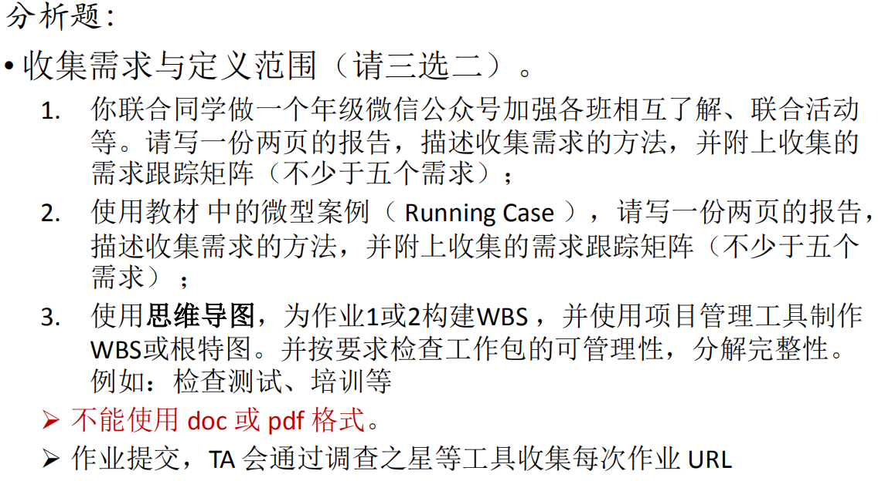
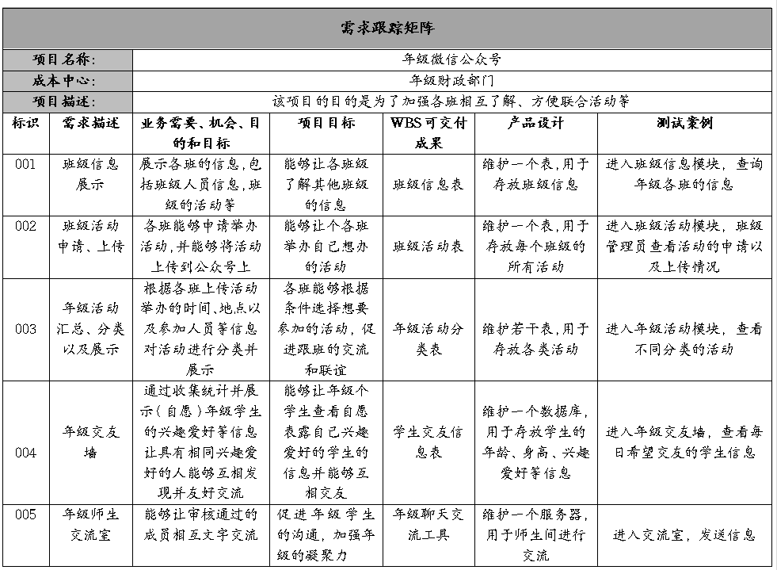
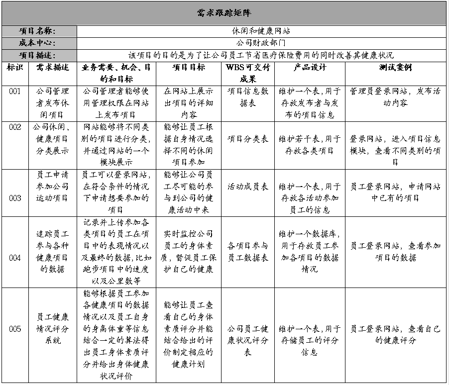

# IT项目管理 Homework5
## 作业要求
  

## 题目1
### 收集需求的方法：
**1、头脑风暴**  

&emsp;&emsp;群体讨论，开放性的收集项目或产品需求。可以联合同学召开需求收集会议，每位成员根据项目目的发表年级公众号的需求意见，然后进行综合筛选得出项目的需求。  

**2、访谈**  

&emsp;&emsp;可以分别对开发者、专家老师、年级的学生等人员进行“一对一”访问得到他们眼中的年级微信公众号的需求。然后进行统一整理，得出需求。该方法因为避免了讨论过程中可能产生的分歧，所以比较高效，但为了收集到更加完整的需求，需要访问比较多的人员，所以耗时会比较长。  

**3、焦点小组**  

&emsp;&emsp;通过咨询曾经做过类似项目的专家、老师来获得该项目的初始需求，或者召开年级微信公众号需求分析研讨会，后者与需求收集会议类似，不过要相对正式一些。这种收集方式具有一定的局限性，因为虽然专家能给出需求建议，但毕竟项目开发的时间以及面向的用户有差别，所以需求不一定准确。  

**4、问卷调查**  

&emsp;&emsp;采用五点量表，或开放问题调查。通过向年级学生以及老师发放调查问卷，集思广益，收集实际用户的需求，然后进行综合得出该公众号的需求。这种方法虽然能够获得更多的需求建议，但是，首先它需要制定一份详细的问卷，设计比较困难，其次因为很多学生不会太在意问卷的填写，所以不能保证得到的需求真实可靠，信息会比较杂乱，这就考验开发人员的信息整理能力。  

**5、标杆对照**  

&emsp;&emsp;用计划的产品或过程对比类似已有的产品或过程。即可以通过获得已有的类似产品的需求说明书的方式来收集需求，比如其他专业、其他学校的年级微信公众号。如果没有需求说明书，也可以通过对比其他产品的类似功能得出需求，比如对比同样目标（加强了解程度、便于联合活动）的产品，像一些企业的公众号等。这种方法成本低，耗时短，但需要分析者具有较强的业务能力和分析能力。  

### 需求跟踪矩阵：  

  

## 题目2  

### 选择项目：HW4中的“休闲和健康网站项目”  
### 收集需求的方法：
**1、头脑风暴**  

&emsp;&emsp;群体讨论，开放性的收集项目或产品需求。可以联合开发组成员召开需求收集会议，每位成员根据项目目的发表该网站的需求意见，然后进行综合筛选得出项目的需求。  

**2、访谈**  

&emsp;&emsp;可以分别对开发者、公司职员等人员进行“一对一”访问得到他们对网站的需求。然后进行统一整理，得出需求。该方法因为避免了讨论过程中可能产生的分歧，所以比较高效，但为了收集到更加完整的需求，需要访问比较多的人员，所以耗时会比较长。  

**3、焦点小组**  

&emsp;&emsp;通过咨询曾经做过类似项目的专家来获得该项目的初始需求，或者召开"休闲与健康网站"需求分析研讨会。这种收集方式具有一定的局限性，因为虽然专家能给出需求建议，但毕竟项目开发的时间以及面向的用户有差别，所以需求不一定准确。  

**4、问卷调查**  

&emsp;&emsp;采用五点量表，或开放问题调查。通过向公司职员发放调查问卷，集思广益，收集实际用户的需求，然后进行综合得出该网站的需求。这种方法虽然能够获得更多的需求建议，但是，首先它需要制定一份详细的问卷，设计比较困难，其次因为部分人员不会太在意问卷的填写，所以不能保证得到的需求真实可靠，信息会比较杂乱，这就考验开发人员的信息整理能力。  

**5、标杆对照**  

&emsp;&emsp;用计划的产品或过程对比类似已有的产品或过程。即可以通过获得已有的类似产品的需求说明书的方式来收集需求，比如其他公司的类似网站。如果没有需求说明书，也可以通过对比其他产品的类似功能得出需求，比如对比同样目标的产品，像一些健身房的官方网站等。这种方法成本低，耗时短，但需要分析者具有较强的业务能力和分析能力。  

### 需求跟踪矩阵：  

  
