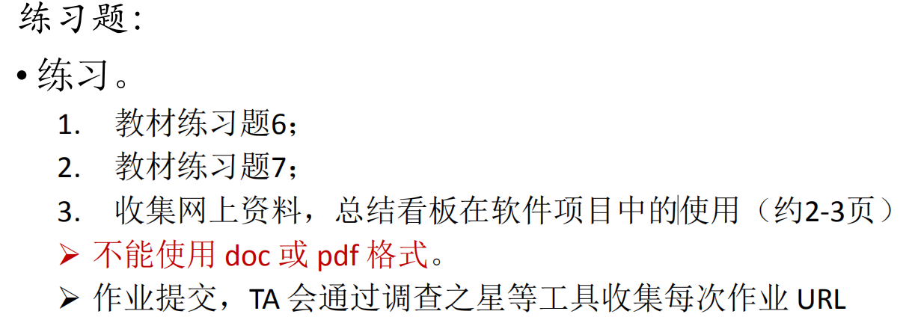

# IT项目管理 Homework6
## 作业要求
  
****
### 1. 教材练习题6

  
****
**a.双代号网络图如下：**

****  
**b.网络图中的所有路径和长度**  

- **路径1：** A->B->E->H->K， **长度：** 2 + 2 + 2 + 2 + 2 = 10 
- **路径2：** A->B->E->I->J->K， **长度：** 2 + 2 + 2 + 5 + 1 + 2 = 14
- **路径3：** A->C->F->H->K， **长度：** 2 + 3 + 3 + 2 + 2 = 12
- **路径4：** A->C->F->I->J->K， **长度：** 2 + 3 + 3 + 5 + 1 + 2 = 16
- **路径5：** A->D->G->J->K， **长度：** 2 + 4 + 6 + 1 + 2 = 15  
****  
**c.关键路径和长度**

- **关键路径（最长时间）：** A->C->F->I->J->K  
- **长度：** 2 + 3 + 3 + 5 + 1 + 2 = 16  
****  
**d.完成该项目所需最短可能时间**  

- 16天  
****
### 2. 教材练习题7

  
****
**2.1 任务进度表和甘特图**  

- `任务进度表`：如下图左半部分所示，任务进度表是用来记录项目各个子任务进度的表，与项目的网络图类似，都包含了活动（任务）名称、工期，不同的是多了每个活动的开始时间和完成时间，以及每个任务的前置任务，这里的前置任务指的是在一个任务之前必须完成的任务。  
  
- `甘特图`：如下图右半部分所示，甘特图是通过进度条的形式来表示各个子任务的进度，并且通过连线表示任务之间的前后关系，相比任务进度表，甘特图能够更直观的感受到任务的时间进度。  
  
   

****  
**2.2 网络图与关键路径**

- `网络图`：如下图所示，与练习6的双代网络图类似，只不过是将任务进度表中的每个子任务的信息（包括开始时间、完成时间、任务的标号以及工期）通过一个矩形展示，然后通过箭头表示子任务之间的前后依赖关系。  
  
    

- `关键路径`：指网络图中耗费最长时间的路径，能侧面反映整个项目的最短工期，即上面网络图中的红色路径：  
  
  路径为：A-D-F-G-I-K-L，时间为：10 + 4 + 6 + 4 + 6 + 8 + 10 = 48 天  
  
****  

**2.3 浮动时间**  

- `浮动时间`：如下表所示，每个子任务的浮动时间是指在不影响后续任务执行的条件下任务可以延误的时间，  

  

****
### 3. 看板在软件项目中的使用

#### **3.1 什么是看板**  
  
`看板管理`，常作“Kanban管理”（来自日语“看板”，カンバン，日语罗马拼写：Kanban），是指为了达到JIT准时生产方式而控制现场生产流程的工具。看板就是表示出某工序何时需要何数量的某种物料的卡片，又称为传票卡，是传递信号的工具。敏捷开发里的“看板”，或者称为贴满纸片的墙其实并不是看板系统，他们仅仅是可视化控制系统，是让团队以可视化方式观察WIP并进行自组织，便可自行分派任务，讲工作从待办列表中移到完成状态。

下图就是一个贴满便签纸的实体白板看板，可以看到看板的基本列表项有：`ToDo`、`Doing`以及`Done`。  

这些列表项可以根据团队的规模进行增减，比如你的团队既要做程序设计，又要做测试和运维，那么看板的列表项就可以是`Todo`、`Dev-Doing`、`Dev-Done`、`Testing`、`Deploy`。  

    
****  

#### **3.2 看板在软件项目流程中的载体**  

**3.2.1 实体白板/黑板**  

这是敏捷开发团队中用的最多，最直接的一种看板类型，且适合团队所有成员都在一个办公室工作的环境。

它的优点一目了然，方便工作成员展示自己的任务和进度，另一方面则可以提高成员间互相竞争的意识（谁干的多，谁解决的问题越难，成就感就越强）。当然，缺点也很明显，就是没有历史记录。虽然可以使用不定期的拍照来解决，但是还是不方便追溯。

白板适用在项目管理中所包含的元素有：
* 白板
* 列表(纵向列表、横向泳道)
* 便签纸
* 图钉、磁铁  

**3.2.2 互联网式的看板**  

既然有实体工具，当然也有软件化的工具。国内外的项目管理工具非常多，但是能实现敏捷开发的工具却不多，而能像看板一样展示的工具更不多。以下介绍几款我接触到的看板工具：
* Trello：有网页端也有移动端，网址：https://trello.com/
* WeKan：参考Trello实现的开源版。与Trello最大的区别在于每个任务没有Deadline，且没有移动端。网址：https://wekan.io/
* leangoo：国人开发。网址：https://www.leangoo.com/

在软件类的项目管理工具中，最大的优点就是有历史记录的追溯，方便查询快照，而且对于一个成员在异地工作的团体来说，互联网式的看板工具是一种最好的选择。  

****  
#### **3.3 使用看板的收益**  

在看板方法中，我们探讨的是：`调度 (scheduling)`、`排序(sequencing)`、`选择（selection）`（即：3S）以及`可选项`、`承诺`、`产能分配`、`风险管理`与`规避`。我们使用预测来替代估算。预期是建立在概率报告基础上的，调度是基于对风险承受能力的评估，与之相对，经济损失是基于特定成果发生的概率。我们教给项目经理们如何建立规则来管理这些活动，如何去调整这些规则去管理项目的业务目标和业务风险。

在项目管理中使用看板方法能够改进产出物的质量，看板方法提高了项目的可预见性，并改进项目可接受的经济指标。整个项目进程更加透明。虽然关注重点是在规则的制订上，但是管理却得到了改进。项目经理转变为主抓风险管理，同样，风险管理也得到了很好的改进。使用看板方法后，项目经理为项目团队和整个组织，创造了更大的价值。  

****
#### **3.4 软件项目中的看板分类**  

**3.4.1 项目管理者主导型**  

顾名思义，这种看板是以软件项目管理者为主导，将任务分配给项目的各个成员，成员只需要根据看板中信息完成相应的任务就行了。下面是一个例子，其中每一行表示一个成员的任务情况：

    

**3.4.2 项目成员主导型**  

与项目管理者主导不同的是，此种看板虽然同样要项目管理者将软件项目拆分成各个小任务，但任务的分配方式有所改变：项目成员根据自己的能力挑选任务完成。下面是一个例子，可以看到在看板中除了有任务标识之外，还在下方标示出了执行此项任务的成员：

    