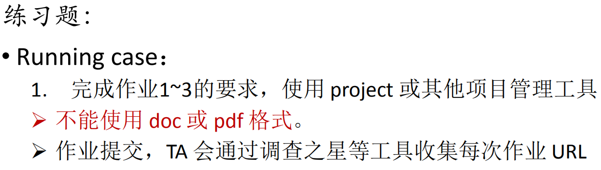
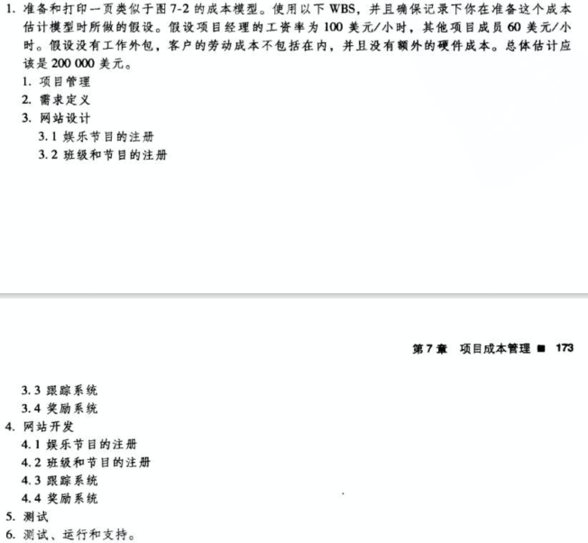
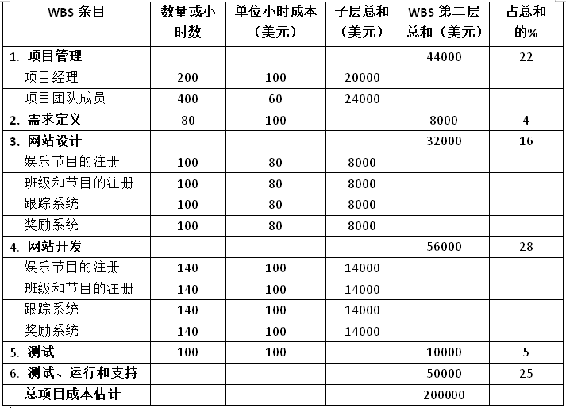
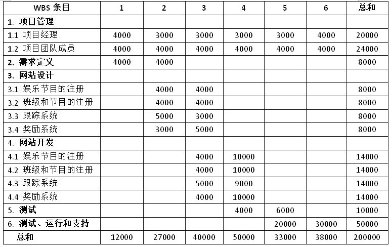
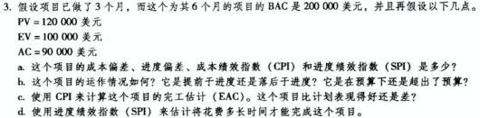

# IT项目管理 Homework7
## 作业要求
  
  

****
### 1. 作业1  
  

**成本模型如下：**

  
   
****
### 2. 作业2
要求：使用你上面制作的成本模型，通过按WBS分配成本，为这个项目每个月（6个月）制定成本基线  

  

****
### 3. 作业3  
  

**a.**
- 成本偏差 = EV - AC = 100000 - 90000 = 10000 美元
- 进度偏差 = EV - PV = 100000 - 120000 = -20000 美元
- 成本绩效指数（CPI） = EV / AC = 100000 / 90000 = 111.11%
- 进度绩效指数（SPI）= EV / PV = 100000 / 120000 = 83.33%

**b.**
- 运作情况：因为成本偏差是一个整数，所以项目的运作在预算内；因为进度偏差是一个负数，所以项目的运作是落后于进度.  

**c.**

- 完工估计（EAC） = BAC / CPI = 200000 / (111.11%) = 180000 美元；因为EAC < BAC，所以项目比计划表现得好.

**d.**
- 花费时间估计 = 计划时间 / SPI = 6 / (83.33%) = 7.2 月