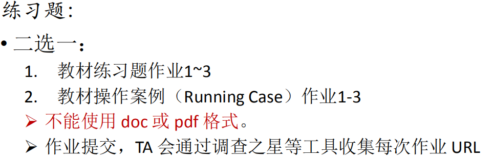
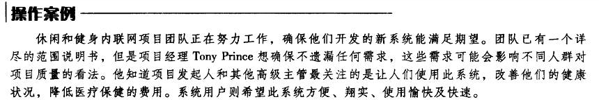
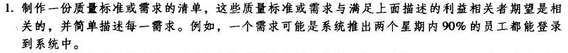
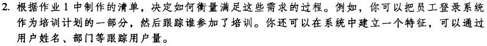
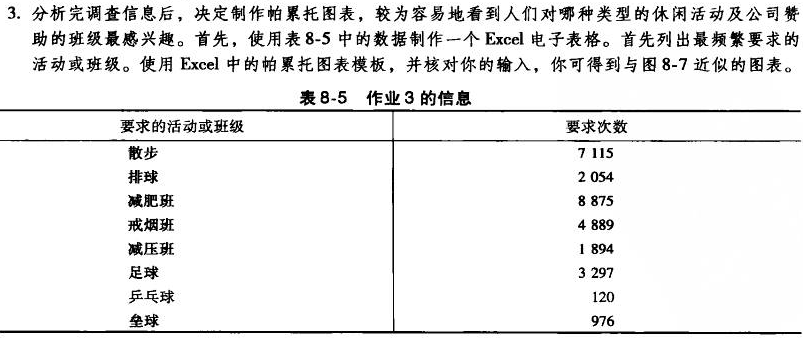
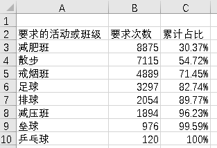
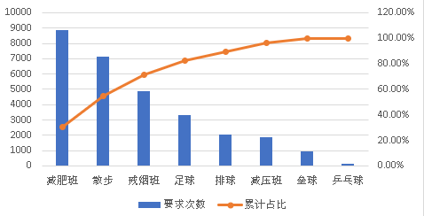

# IT项目管理 Homework8
## 作业要求
  

****
## 操作案例  
  
****

### 1. 作业1  
  

**质量需求清单**：
- 系统推出两个星期内90%以上的员工都能登录到系统中（满足项目发起人和其他高级主管的期望）
- 登录到系统中的员工在两个星期内有90%能够熟练使用系统（满足系统方便要求）
- 系统中能够包含50%的目前存在的休闲与健身项目（满足系统翔实要求）
- 系统推出一个月内有超过90%的员工参与到其中的项目，并且两个月内身体健康状况有所改善（满足项目发起人和其他高级主管的期望）
- 系统能够收获到参与系统项目员工90%以上的好评，同时其中有90%以上的人觉得系统快速（满足用户使用愉快、快速要求）  

****

### 2. 作业2
 
  

**衡量方式（与前面质量需求清单对应）：**
- 将用户姓名和部门作为特征跟踪用户登录系统的信息，再与公司现有的员工记录对比得出员工登录系统率
- 记录员工使用系统的痕迹，将员工能够熟练使用系统的标准定为已经使用系统90%以上的功能，从而根据员工使用的功能来衡量该需求
- 直接统计系统中的休闲和健身项目，得出占现有项目的比重
- 记录每个员工参与系统项目的信息，同时记录员工的体重、肺活量、体脂等数据，以此来判断有多少员工参与其中同时判断员工的身体健康状况是否得到了改善
- 系统增加评分机制，记录每个员工的评分，得出好评率

****
### 3. 作业3  

  

- Excel电子表格：

    

- 帕累托图：  

  

