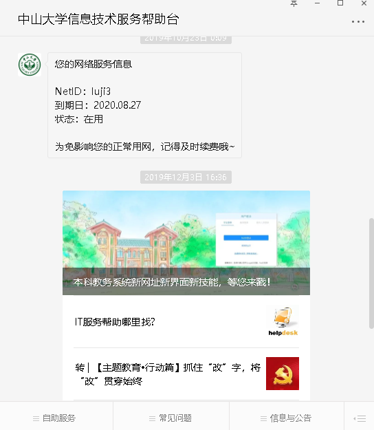
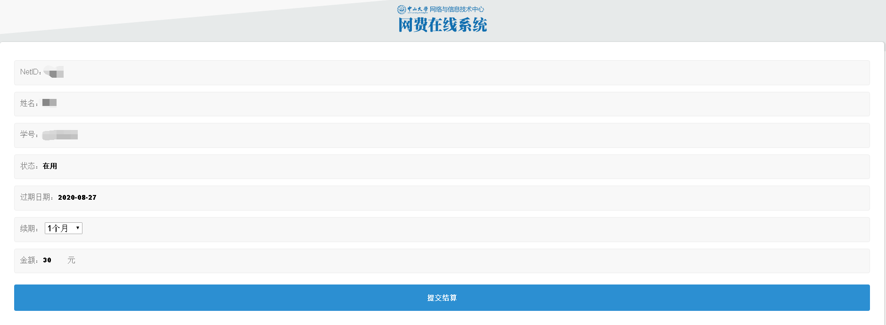
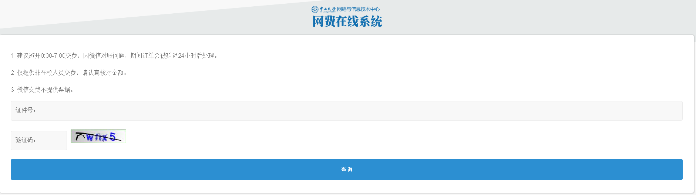
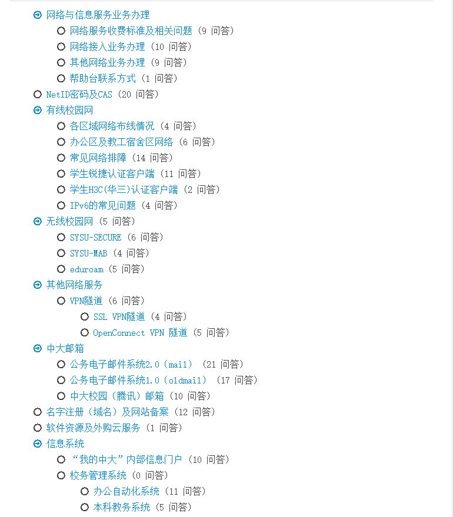

# 微信公众号服务分析

## 1、中山大学信息技术服务帮助台  

帮助台是`校园网信息技术服务与支持`的统一入口，用户可以通过电子邮件、语音呼叫和FAQ知识库来获取帮助。主页面如下：

  

### 功能分析
- `NetID的绑定和解绑`：该功能用于绑定和解绑学生的网络ID和微信校园网服务  

  `绑定界面`：输入NetID和密码或者通过微信扫码可以绑定NetID  

    

- `个人网络续费`：该功能用于校园网费用充值

  `充值界面`：可以清晰地看到校园网使用状态同时选择续费的时间

    

- `校外网络续费`：该功能针对非在校人员的网络缴费

  `缴费界面`：通过输入身份证号查询网络服务  

    

- `常见问题`：该模块主要是对用户常见问题的解答，问题如下：

    

