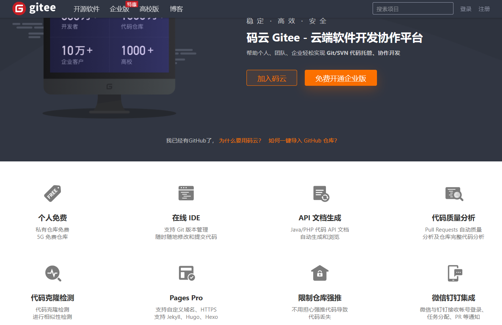
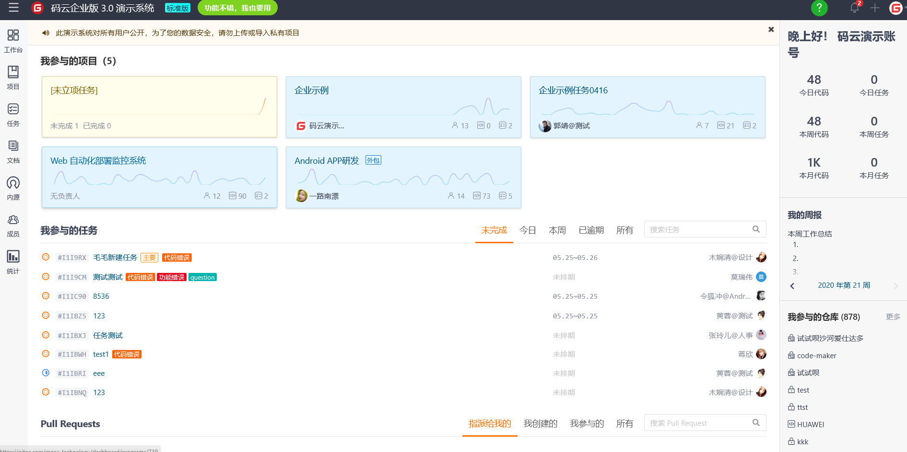
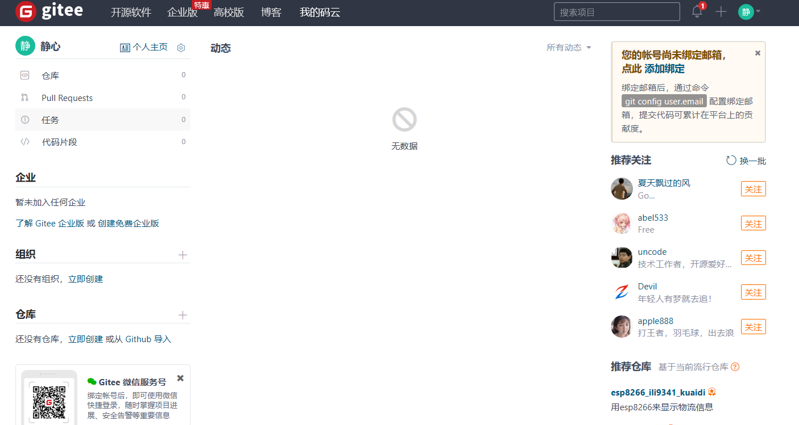

# 码云分析

## 产品特色
码云是基于Git的代码托管和云端软件开发协作平台  

     

### 1、中文界面
码云从某个层面来讲可以看作中文版Github，可以让团队交流更加效率。  

     

### 2、免费的私有库
其它几乎所有软件开发协作平台（如Github）将私有库作为收费功能，而码云免费提供私有库。  
   
     
   
### 3、完善的代码处理能力
拥有在线IDE可以随时修改、编译、运行代码，同时可以自动对仓库的代码进行质量分析（Sonar），并且还可以对代码进行相似性检测。
### 4、限制仓库强推
不用担心强推代码（-f参数）导致代码丢失
### 5、同时支持Git和SVN
能够同时使用Git和SVN进行代码托管  
……

## 业务支持
  
### 1、微信开发
### 2、区块链应用开发
### 3、WEB应用开发
### 4、手机/移动开发
### 5、数据库管理/监控
……
## 工具
### 1、在线IDE
支持 Git 版本管理，随时随地修改和提交代码
### 2、API 文档生成 
Java/PHP 代码 API 文档自动生成和浏览
### 3、项目演示
可创建一个演示来部署并启动项目
### 4、代码质量分析
Pull Requests 自动质量分析及仓库完整代码分析
### 5、代码克隆检测
对代码进行相似性检测  
……