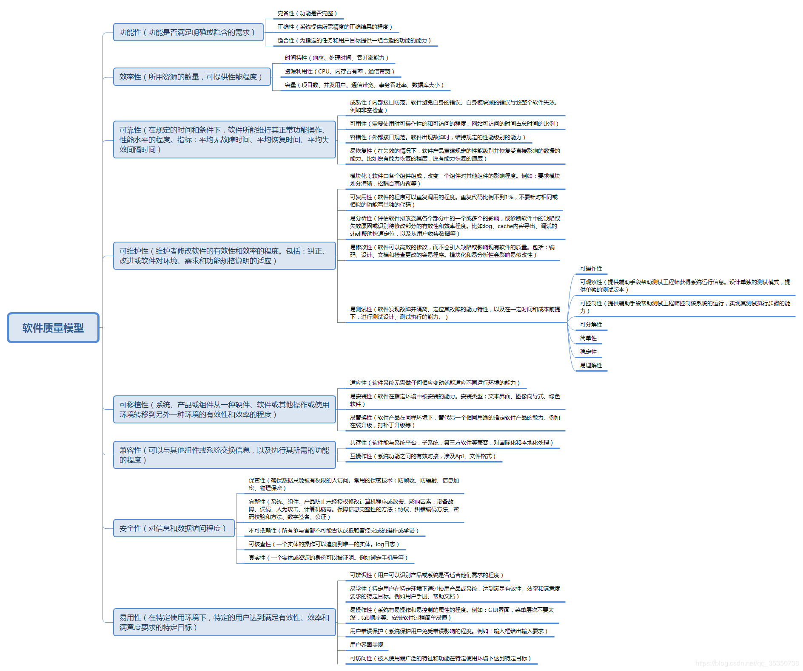

## 项目个人总结报告

因为这次是要做一个与校园服务相关的IT项目，所以首先我们按照要求调查梳理了中山大学为学生提供的软件产品、在线服务，在这一部分我的任务是分析中山大学信息技术服务帮助台的功能信息。在分析中山大学信息技术帮助服务台的时候，我主要对界面的设计以及具体的功能进行了分析，这样就可以对类似的产品有一个大概的框架，这会对我在以后的相似项目上的设计有所帮助。然后其他组员也分析了其他一些产品和服务，最终我们定下了我们小组要做的软件项目：学校资源共享软件项目。旨在为中大师生提供一个统一、便利的学习资源共享平台，建设中大全体师生的共享网盘，为教学、学习提供便利。之所以要做这样一个软件项目，是因为经过我们小组的分析，学校在这一方面提供的服务并不完善，并且学生群体是需要这样一个软件的。尽管这一部分工作的目的只是为了方便项目方向的选择，但我仍然学到了东西：当我们要去做某个类型的IT项目时，首先要去分析当前存在的一些软件产品，然后根据市场需求，去优化一些现有的产品或者是做一些目前还不存在或者很不成熟的IT产品，这样才能够在市场中有竞争力。  

然后项目的第二部分工作是对竞争产品的分析。在第一部分初步了解了与校园相关的IT项目，定下了我们小组需要做的项目之后，那么这一部分就是要对市场上已经存在的相似产品进行分析，然后从中总结出我们该怎么做。我们小组分析了三种产品，分别是码云、阿里云云效以及腾讯CODING DevOps，在分析过程中，我们从产品特色、业务支持以及产品拥有的工具三个方面对其进行了分析。我的工作是对码云进行分析，在这个过程中我学到了怎样去做好一个学习资源共享项目，包括方便用户的界面的设计以及合适的功能的实现。

接着项目的第三部分内容是完成整个项目的启动，包括建立一个文档仓库，编写项目章程、项目管理计划以及调查初步需求。我的工作是编写项目章程，这在平时个人作业中已经有了练习。尽管它只是一个项目的辅助工作，但它对于整个项目的完成而言是至关重要的，因为它相当于整个项目的计划。要知道如果一个项目缺少了项目章程，那么这个项目在实现的时候效率会非常低。这在我们平时的工作中就会经常体现，没有计划的工作往往是效率低下的。项目章程的内容包括项目名称、项目开始日期、项目结束日期、项目目的、成功标准、高层级需求、整体项目风险、总体里程碑进度计划、预先批准的财务资源、关键相关方名单等方面，它是对整个项目的一个规划，包括时间规划、进度规划、标准规划、财务规划等。毫不夸张的说，我认为项目章程是一个项目的钥匙，它打开了整个项目的大门。

项目的最后一部分任务是基本实现整个项目，然后对项目做静态代码分析、功能测试，构建CI/CD流水线等。我的工作是收集系统的"非功能需求"。我的做法就是根据下面的软件质量模型框架，结合我们小组项目的性质以及功能需求，对框架中的非功能性需求进行逐一分析，然后得出了具体到学习资源共享软件项目的非功能需求。与系统的功能性需求不同的是，非功能需求更加关注的是系统的性能，包括它的处理速度、系统容量、资源占用率、可靠性、可维护性、兼容性等，这些需求基本上是要在软件系统实现之后才会去关注的。而功能性需求则是贯穿整个项目的实现过程的。换个方式讲，功能需求决定了项目的性质以及需要实现的功能，而非功能需求则是决定了项目软件的性能以及需要满足的一些内外条件。这二者对于整个项目来讲都是缺一不可的。

  

总的来说，在整个项目的完成过程中，我的主要任务都是一些项目辅助工作，没有涉及到一点编程。一部分原因是这次时间太紧，我们的项目并没有完整实现，所以真正需要编程的地方很少，整个团队就只有2个人做了编程工作，他们分别实现了接口设计和前端设计。另一部分原因则是我自己没有去选择编程任务，一方面是我觉得自己的编程能力并不是很强，既然小组里面有大佬，那我就干脆给他们"打打下手"就好了；另一方面其实我开始是想做一些编程工作的，因为我觉得在一个IT项目团队中你只做一些无关代码的工作是没有太大收获的，我还是想通过这个项目学到一些代码方面的东西，只是当我想要争取的时候其他人已经选走了这一部分的工作。希望在今后的IT项目团队里我能够努力的去争取到一些编程工作吧。
